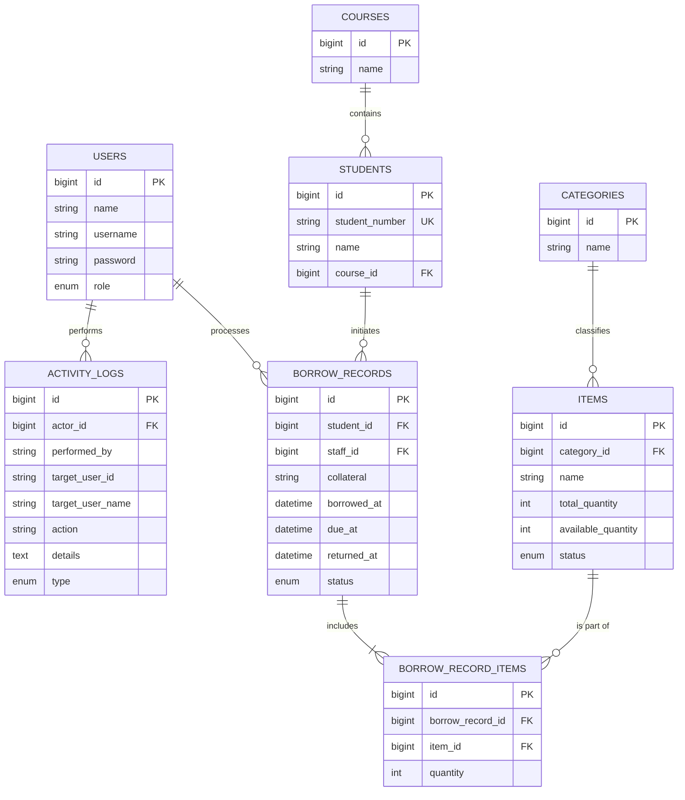

# Entity Relationship Diagram — BorrowHub API

This diagram visualizes the relational structure of the BorrowHub database.

## Relationship Key
- **One-to-Many (`||--o{`)**:
    - A **User** can process many **Borrow Records**.
    - A **Student** can have many **Borrow Records**.
    - A **Category** can contain many **Items**.
- **Many-to-Many (`||--|{` via Pivot)**:
    - **Borrow Records** and **Items** are connected through the `borrow_record_items` pivot table, allowing a single transaction to include multiple pieces of equipment.
